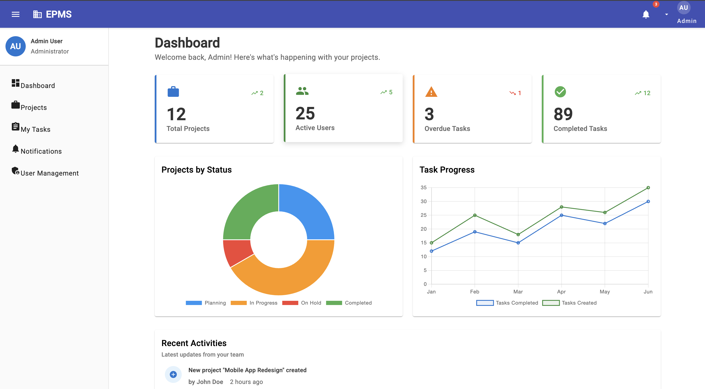
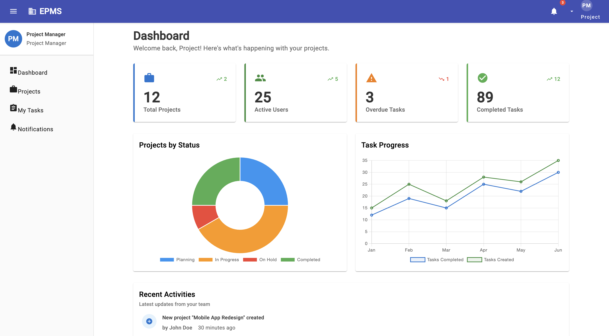
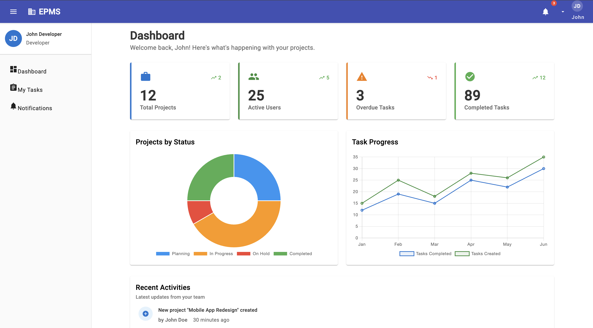
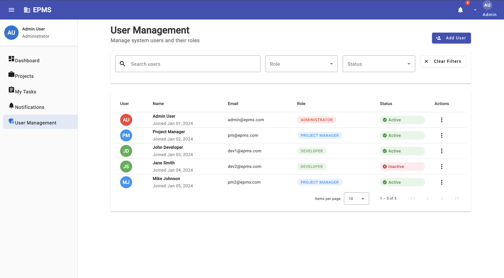
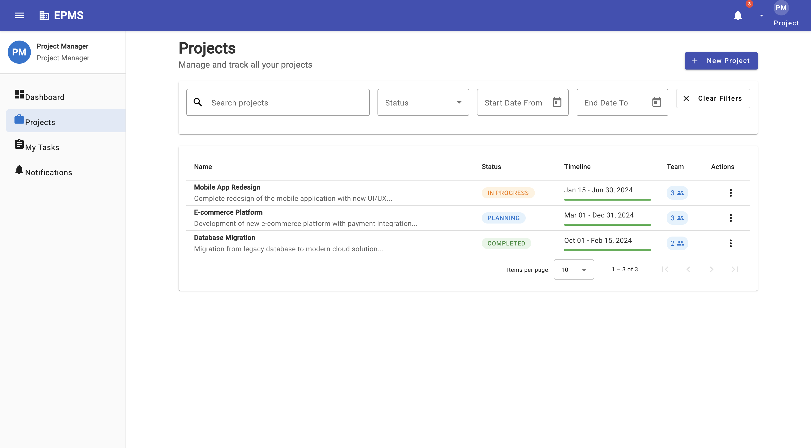

## Enterprize Project Management System
> Develop a responsive, modular, and scalable Angular-based Enterprise Project Management System (EPMS) that includes:
- Project and Task management
- Role-based access control
- Team and user management
- Reusable components and services
- API integration (mock or real)
- Performance optimizations

---

### Cloning the application
To clone the repository, follow these steps:
1. Install [Git](https://git-scm.com/downloads) (if not already installed).
2. Copy the **HTTPS URL**, https://github.com/divyasinha31/epms.git.
3. Open a terminal, navigate to the desired location, and run: `git clone https://github.com/divyasinha31/epms.git`

---

### Running the application locally
To run the application locally, follow these steps:
1. Once cloned, run `npm install` to install the relevant Node packages.
2. Next, run `npm run dev` to simutaneously run the json server and angular server and navigate to [http://localhost:4200/](http://localhost:4200/).

---

### Login with different user roles
In the current application, we have 3 different roles.
- Developer
	- This is the most basic user for the EPMS System
	- Login creds:
	Username: dev@epms.com
	Password: developer123
- Project Manager
	- Apart from the developer's access, the project manager also handles the Projects module.
	- Login creds:
	Username: pm@epms.com
	Password: manager123
- Developer
	- Apart from the project manager's access, the administrator also handles the Users module.
	- Login creds:
	Username: admin@epms.com
	Password: admin123

---

### Snaps from the portal
> For Administrator
> 
> For Project Manager
> 
> For Developer
> 
> Users Module For Admin
> 
> Projects Module For Admin and Project Manager
> 